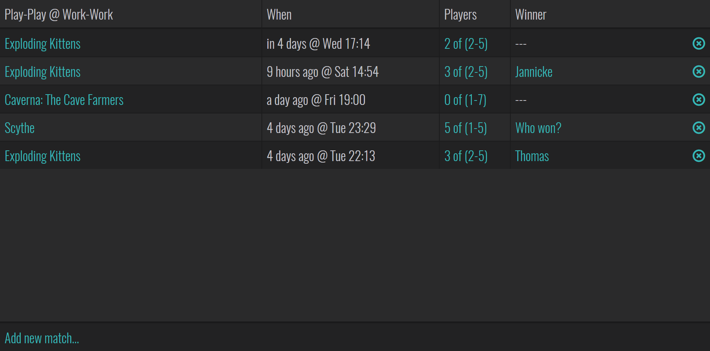
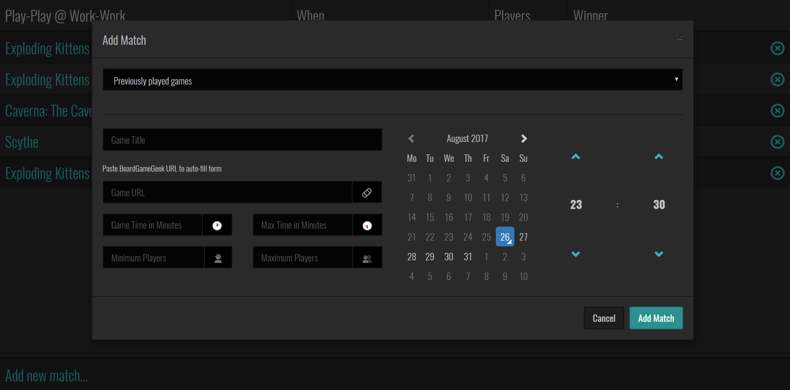

# Play-Play

## What is Play-Play?

A web application for creating display boards organizing game matches. Let your
friends and colleagues know when and what is being played.

## Requirements

These are what was used to create the project. It does not necessary represent
minimum requirements.

* Rasberry Pi 3
* Raspian Stretch
* Python 3

### Fonts

If you try to view the app from the Pi, or any other Linux distribution you
might experience that some glyphs doesn't display correctly. You might see
squares instead. For a workaround to this refer to FONTS.md.

## Configuration

The application can be configured by creating a `playplay/config.js` file.
You can use `playplay/config.default.json` as a reference template.

Right now it's just the application title.

    {
      "title": "Play-Play"
    }

## Development Server

Play-Play is a Flask application. You can use Flask's development server for
development testing.

**For release deployment see DEPLOYMENT.md.**

### Setting Up

#### Clone the project

    mkdir ~/code
    cd ~/code
    git clone https://github.com/thomthom/play-play.git

#### Create a Python Virtual Environment

    sudo pip3 install virtualenv
    virtualenv playplayenv
    source playplayenv/bin/activate

#### Install Flask App

    pip install --editable .

#### Configure Flask App

    export FLASK_APP=playplay
    flask initdb

#### Run Development Server

    flask run

The application can be accessed from: http://localhost:5000/

To allow access from the network:

    flask run --host=0.0.0.0
